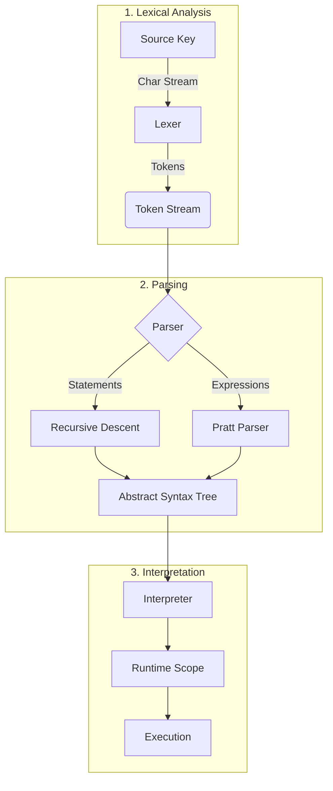

# KukuLang Design & Architecture 🏗️

Welcome to the architectural heart of KukuLang. This document details the inner workings of the compiler and interpreter, offering a deep dive into how English-like syntax transforms into executing code.

---

## 📖 Table of Contents
1.  [Introduction](#-introduction)
2.  [High-Level Architecture](#-high-level-architecture)
3.  [The Pipeline](#-the-pipeline)
    -   [Phase 1: Lexical Analysis](#phase-1-lexical-analysis)
    -   [Phase 2: Parsing](#phase-2-parsing)
    -   [Phase 3: Interpretation](#phase-3-interpretation)
4.  [Runtime System](#-runtime-system)
    -   [Memory & Scopes](#memory--scopes)
    -   [Type System](#type-system)
5.  [Error Handling](#-error-handling)

---

## 🎯 Introduction
KukuLang is designed with a specific philosophy: **"Complexity in logic, Simplicity in syntax."**
It implements a standard interpreted language architecture but adapts the parsing stage to handle the verbosity and flexibility of natural language.

### Core Goals
-   **Readability**: Code should flow like a sentence.
-   **Safety**: Strong static typing prevents runtime surprises.
-   **Transparency**: Steps from source to execution should be logical and traceable.

---

## 🏰 High-Level Architecture

The system follows a classic **Three-Stage Pipeline**.



---

## ⚙️ The Pipeline

### Phase 1: Lexical Analysis
**Goal:** Convert text into "Words" (Tokens).

The `Lexer` scans the source code character by character. Instead of a complex Regex engine, it uses a custom **"Scan-until-delimiter"** approach.
-   **Delimiters**: Whitespace, operators, quotes, and special symbols (`~`, `'`).
-   **Optimization**: It uses a `TokenMap` cache to instantly recognize keywords like `set`, `define`, `if` in O(1) time.

### Phase 2: Parsing
**Goal:** Convert "Words" into "Sentences" (AST).

We use a **Hybrid Parser** to handle the distinct nature of statements and expressions.

#### A. Recursive Descent (Statements)
Used for high-level structures. It predicts the next step based on the current keyword.
```csharp
// Concept:
if (Token == "define") -> ParseDefinition();
if (Token == "if")     -> ParseIfStatement();
```

#### B. Pratt Parser (Expressions)
Used for math and logic (`a + b * c`). It assigns a **Binding Power** (Precedence) to every operator to ensure correct evaluation order without massive recursion chains.

### Phase 3: Interpretation
**Goal:** Execute the "Sentences".

The `Interpreter` is a **Tree-Walker**. It visits every node in the AST and performs the associated action.
-   **Statements**: Executed immediately (e.g., creating a variable).
-   **Expressions**: Evaluated to return a `RuntimeObj`.

---

## 🧠 Runtime System

### Memory & Scopes
KukuLang manages memory using a hierarchical **Scope Chain**.

1.  **Global Scope**: The root environment.
2.  **Function/Block Scope**: Created whenever `{` is entered.
3.  **Resolution**: To find a variable, we check the *Current Scope*. If missing, we walk up to the *Parent Scope*.
4.  **Disposal**: When a block ends (`}`), the Scope is disposed, effectively removing local variables from memory (though relying on C#'s GC for final cleanup).

### Type System
KukuLang is **Statically Typed**. Types are checked at Definition time, but values are wrapped in dynamic `RuntimeObj` containers during execution.

**Supported Types:**
-   **Primitives**: `int`, `float`, `text`, `bool`.
-   **Complex**: `CustomType` (structs) defined by the user.

**Object Model**:
A user-defined object (like `Human`) is internally just a Dictionary:
```csharp
// Internal representation of a "Human" object
Dictionary<string, RuntimeObj> properties = {
    { "name", new RuntimeObj("John") },
    { "age",  new RuntimeObj(30) }
};
```

---

## 🛡️ Error Handling
Errors are meant to be helpful, not scary. The compiler tracks:
1.  **Line Number**: Where it happened.
2.  **Column**: Exact position in the line.
3.  **Context**: What was the parser trying to do?

**Example Error:**
> *Error at line 12: Expected 'to' after 'set', but found 'is'.*

---

## 🔮 Roadmap & Future

We are constantly improving the engine. Key areas for future research:
1.  **Bytecode Compilation**: Moving away from Tree-Walking to a Stack-based Virtual Machine for performance.
2.  **Module System**: Allowing `import` across files.
3.  **Standard Library**: Built-in math and string manipulation functions.

---

*This document serves as the technical blueprint for KukuLang v2. For implementation details, refer to the code in the `FrontEnd` directory.*