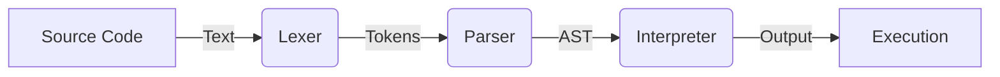

# KukuLang Frontend Internals ⚙️

The Frontend is the heart of the KukuLang runtime. It acts as the pipeline that transforms your English-like source code into actual execution. This directory contains the implementation of the three primary stages of the language processing pipeline.

## The Pipeline

The journey of a KukuLang script follows this path:

### 1. [Lexical Analysis (Lexer)](Lexer/README.MD)
**Turning Text into Words.**
The Lexer (or Scanner) reads the raw source code text and breaks it down into meaningful distinct chunks called "Tokens". It handles things like recognizing keywords (`set`, `define`), literals (`12`, `"hello"`), and ignoring whitespace or comments.

### 2. [Parsing (Parser)](Parser/README.MD)
**Turning Words into Sentences.**
The Parser takes the stream of Tokens and analyzes them against the grammatical rules of KukuLang. It builds a hierarchical structure called an **Abstract Syntax Tree (AST)**. This tree represents the logic and structure of your program (e.g., "This is an If-statement containing a code block").

### 3. [Interpretation (Interpreter)](Interpreter/README.MD)
**Executing the Sentences.**
The Interpreter walks through the AST and performs the actions described. It manages memory, scopes, variable assignments, and mathematical operations in real-time.

---

## Directory Structure

- **`/Lexer`**: internal logic for tokenization.
- **`/Parser`**: The parsing logic, including the Recursive Descent parser for statements and Pratt parser for expressions.
- **`/Interpreter`**: The runtime engine that executes the parsed code.
- **`/Commons`**: Shared utilities, exceptions, and common data structures used across the frontend.